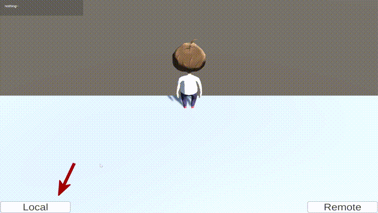

#### 基于Unity和C++后端使用gRPC点对点通信开发的位置判断demo

#### A location determination demo developed using gRPC point-to-point communication based on Unity and C++backend

**目的：**建立与后端的gRPC通信，后端判断人物坐标是否在平面内，判断结果返回给前端

**细节：**本地后端使用C#开发，远程服务器后端使用C++开发，每秒通信一次

**困难：**gRPC版本变化大，环境搭建教程错误多，与Unity结合案例少

**解决：**从历史版本挑选最匹配的，参考官方文档，自己摸索

**GitHub链接：**https://github.com/550B/Unity-and-gRPC.git

**Purpose: **To establish gRPC communication with the backend, which determines whether the character coordinates are in the plane and returns the judgment results to the frontend
**Details:** The local backend is developed using C #, while the remote server backend is developed using C++, with communication occurring once per second
**Difficulty:** gRPC version changes significantly, there are many errors in the environment setup tutorial, and there are few cases of combining with Unity
**Solution: **Select the best match from historical versions, refer to official documents, and explore on my own
**GitHub link: **https://github.com/550B/Unity-and-gRPC.git

